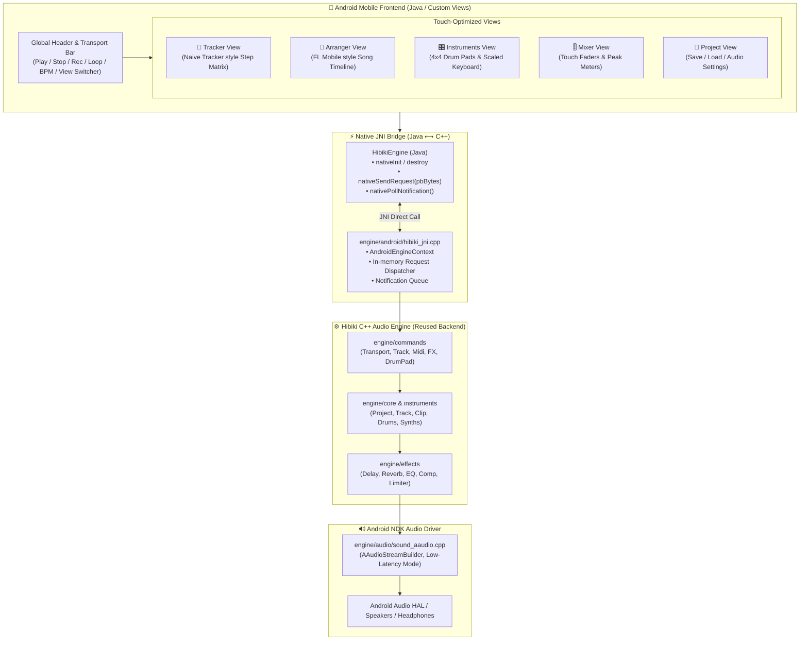
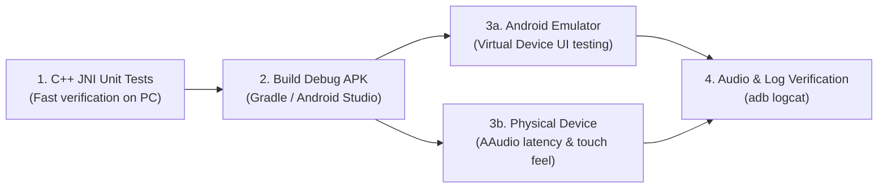

# Android Support & Mobile Sequencer Guide

This guide documents the architecture, mobile UI design, and end-to-end verification procedures for running Hibiki DAW on Android devices and emulators.

---

## 1. Architecture Overview

Hibiki DAW on Android reuses **100% of the core C++ audio engine and DSP backend** while providing a touch-optimized mobile frontend built purely in **Java and high-performance Android Views**.



### Process Model: Desktop vs. Android

| Characteristic | Desktop Hibiki (Linux / macOS / Windows) | Android Hibiki |
| :--- | :--- | :--- |
| **Execution Model** | Spawns `hbk-play` subprocess | Runs in-process via `libhibiki_jni.so` |
| **Communication** | IPC Pipes (stdin/stdout) or TCP sockets | Direct JNI memory calls (zero IPC pipe overhead) |
| **Audio Driver** | ALSA (Linux) / CoreAudio (macOS) / WASAPI (Win) | **AAudio** (Android NDK standard low-latency API) |
| **Frontend Framework**| Java Swing / FlatLaf | **Java Android Views** |


---

## 2. Mobile Sequencer & Tracker UI Concept

The mobile UI is designed from the ground up for handheld touchscreens and tablets, inspired by **Naive Tracker** (Oliver Wittchow / Nanoloop style groovebox tracker) and **FL Studio Mobile**:

### Key Views & Components

1. **Header & Transport Bar** (`ui/components/HeaderBarView.java`):
   - Transport buttons: Play/Pause, Stop, Record, Loop toggle.
   - Master Tempo (BPM) control with `+`/`-` nudge buttons and tap-tempo.
   - High-precision `MM:SS.ms` playhead clock and master VU meter.
   - View switcher tabs: `[ TRACKER ]` `[ ARRANGER ]` `[ INSTRUMENT ]` `[ MIXER ]` `[ PROJECT ]`.

2. **Tracker View** (`ui/views/TrackerView.java` — *Naive Tracker Inspiration*):
   - Vertical step matrix (Step 00 to 15 / 31 / 63) across 4–8 channels.
   - Dedicated columns for `NOTE` (`C-4`), `VEL` (`7F`), `INST` (`01`), and `FX` (`0F`).
   - Quick-edit note insert, pitch picker wheel, and real-time scanning playhead cursor.

3. **Arranger View** (`ui/views/ArrangerView.java` — *FL Mobile Inspiration*):
   - Multi-track horizontal song timeline holding color-coded pattern blocks.
   - Time ruler with bar numbers and interactive scrubber.
   - Touch gestures to paint, duplicate, or trim pattern clips.

4. **Performance Instruments View** (`ui/views/InstrumentView.java`):
   - **4x4 Drum Pads**: Touch pads with velocity simulation and trigger animation.
   - **Scale-Locked Touch Keyboard**: Select root note & scale (Major, Minor, Pentatonic, Blues, Dorian) to eliminate wrong notes on small touchscreens.
   - **Macro Rotary Knobs**: Touch-drag knobs for real-time filter cutoff, resonance, attack, and decay adjustment.

5. **Mixer View** (`ui/views/MixerView.java`):
   - Vertical channel strips with touch faders and dB readouts.
   - Pan dials, Mute (`M`), Solo (`S`), and master bus stereo peak meter.

6. **Project View** (`ui/views/ProjectView.java`):
   - Project save/load, demo songs, and audio buffer latency configuration.

---

## 3. How to Verify & Test



### Step 1: Fast Local C++ JNI Verification (on PC)

Before launching an emulator or connecting a physical device, verify the C++ audio engine, JNI bridge, and Protobuf command handling locally on your development machine.

To keep host CPU usage minimal, throttle Bazel resources with `--jobs=2`:

```bash
bazel test //engine/android:hibiki_jni_test -c opt --jobs=2 --local_cpu_resources=2 --test_output=all
```

---

### Step 2: Testing via Android Studio (Recommended GUI)

1. Open **Android Studio**.
2. Select **Open** and choose the `android/` directory inside the repository.
3. Select your target **Android Emulator (AVD)** or **connected physical device** from the device dropdown.
4. Click **Run 'app'** (`Shift + F10` or the green ▶ button).
5. Android Studio compiles the APK, installs it on the target device, and attaches the debugger automatically.

---

### Step 3: Testing via Command-Line Interface (CLI)

#### Option A: Build and Run via Bazel (Unified Workflow)

```bash
# Build the Android APK (automatically builds native libhibiki_jni.so and packages APK)
bazel run //android/app:build

# Launch Android Emulator and run Hibiki DAW app
bazel run //android/app:run
```

#### Option B: Build and Run via Helper Scripts

```bash
# 1. Start the Android Emulator
./tools/start_android_emulator.sh

# 2. Build and launch the DAW on the active emulator/device
./tools/run_android_app.sh
```

#### Option C: Build and Run via Gradle

```bash
# 1. Build Native JNI Engine first
bazel build //engine/android:libhibiki_jni.so -c opt
mkdir -p android/app/src/main/jniLibs/x86_64
cp -f bazel-bin/engine/android/libhibiki_jni.so android/app/src/main/jniLibs/x86_64/

# 2. Assemble Debug APK
cd android
./gradlew assembleDebug

# 3. Install & Launch
adb install -r app/build/outputs/apk/debug/app-debug.apk
adb shell am start -n hibiki.android/.MainActivity
```

#### 3. Run on a Physical Android Device (USB / Wi-Fi)
1. **Enable Developer Options & USB Debugging on your device**:
   - Go to **Settings** → **About Phone** → Tap **Build Number** 7 times.
   - Go to **Settings** → **System** → **Developer Options** → Enable **USB Debugging**.
2. **Connect device via USB and verify**:
   ```bash
   adb devices
   # Accept the "Allow USB debugging?" prompt on your device screen
   ```
3. **Install and launch**:
   ```bash
   cd android
   ./gradlew installDebug
   adb shell am start -n hibiki.android/.MainActivity
   ```

---

### Step 4: Real-Time Audio & Log Debugging

Monitor engine initialization, AAudio stream creation, playhead ticks, and Protobuf commands using `adb logcat`:

```bash
# Filter logs specifically for HibikiEngine, AAudio, and AudioTrack
adb logcat -s HibikiEngine AAudio AudioTrack
```

**Verification Checklist**:
- [ ] Log outputs: `AAudio output stream initialized at 44100 Hz, 2 channels`
- [ ] Low-latency audio playback response when tapping drum pads or scale keys
- [ ] Step tracker cursor advances smoothly in sync with playback tempo
- [ ] Background audio continuity and correct pause behavior on app minimization
