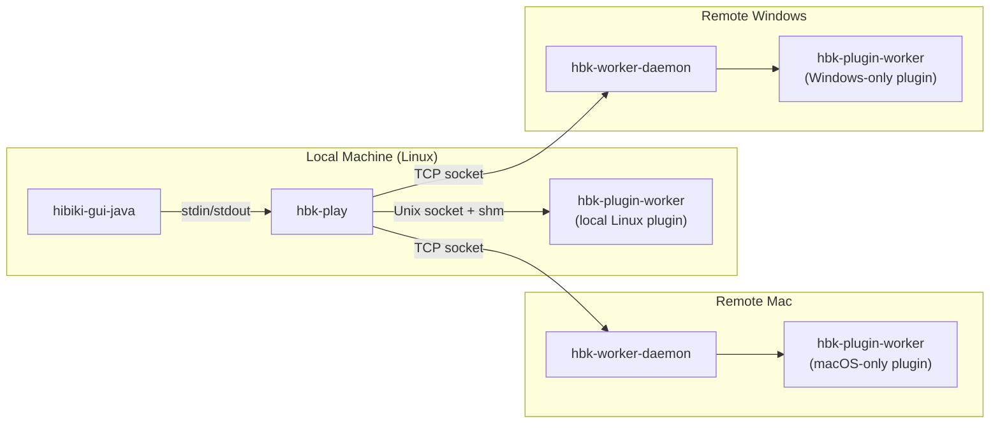

# Hibiki IPC Architecture

Hibiki uses three communication channels, each chosen for the specific
requirements of its communication pair.



## 1. GUI ↔ Backend (`hibiki-gui-java` ↔ `hbk-play`)

**Transport:** stdin/stdout pipes (length-prefixed protobuf)

**Why pipes?**
- **Simplicity**: The Java GUI spawns `hbk-play` as a single child
  process. Pipes are automatically created by `ProcessBuilder` — no
  port allocation, no socket path management, no cleanup.
- **Lifecycle**: Pipe EOF automatically signals process death.
- **Security**: No listening socket exposed.
- **Precedent**: Same pattern as LSP servers, `ffmpeg -f pipe:`.

**Protocol:**
- GUI→Engine: `pb.commands.Request` (framed protobuf)
- Engine→GUI: `pb.notifications.Notification` (framed protobuf)
- Framing: `uint32_t size` + `bytes[size]`

---

## 2. Backend ↔ Local Plugin Worker (Unix socket + shared memory)

**Transport:** Unix domain socket + POSIX shared memory

**Why sockets + shm?**
- **Multiple workers**: Each plugin runs in its own process.
- **Zero-copy audio**: Audio buffers (512 × 2ch × 4B = 4KB per block)
  use shared memory for real-time performance.
- **Crash isolation**: If a plugin crashes, only its worker dies.

**Protocol:**
- Host→Worker: `pb.worker.WorkerRequest` (framed protobuf over Unix socket)
- Worker→Host: `pb.worker.WorkerResponse` (framed protobuf)
- Audio data: POSIX shared memory (`shm_open`/`mmap`)

**Shared Memory Layout:**
```
Offset    Size           Content
0         64 B           Header (block_size, num_channels, flags)
64        N×4 B          Input L
64+N×4    N×4 B          Input R
64+N×8    N×4 B          Output L
64+N×12   N×4 B          Output R
```
Where N = `block_size` (default 512 samples).

---

## 3. Backend ↔ Remote Plugin Worker (TCP + inline audio)

**Transport:** TCP socket (commands + audio inline in protobuf)

**Why TCP with inline audio?**
- **Cross-machine**: Enables running macOS-only or Windows-only plugins
  from a Linux host.
- **No shared memory**: Shared memory doesn't work across machines.
  Audio is serialized as `bytes` in `ProcessAudio.input_audio` and
  `ProcessDone.output_audio` (interleaved float32, little-endian).
- **Bandwidth**: At 512 samples × 2ch × 4B = 4KB per block, the audio
  overhead is ~180 KB/s at 44.1kHz — negligible over LAN.
- **Latency**: ~1-5ms round-trip on LAN, acceptable for non-realtime
  bouncing and tolerable for live playback.

**Protocol:**
- Same `WorkerRequest`/`WorkerResponse` protobuf as local mode
- Audio carried inline in proto `bytes` fields instead of shm
- `WorkerConfig` handshake sets block_size, num_channels, shm mode

---

## POSIX → Windows API Mapping

The following table maps each POSIX API used in `worker_channel_posix.cpp`
to its Windows equivalent, for implementing `worker_channel_win32.cpp`:

### Command Channel (Unix socket → Named Pipe or TCP)

| Operation | POSIX (current) | Windows equivalent |
|-----------|------------------|--------------------|
| Create server | `socket(AF_UNIX, SOCK_STREAM, 0)` | `CreateNamedPipeA("\\\\.\\pipe\\hbk-plugin-XXX", ...)` or `socket(AF_INET, ...)` |
| Bind + Listen | `bind()` + `listen()` | Pipe: implicit in `CreateNamedPipe`. TCP: same as POSIX |
| Accept | `accept()` | Pipe: `ConnectNamedPipe(hPipe, NULL)`. TCP: `accept()` |
| Connect (client) | `connect()` | Pipe: `CreateFileA("\\\\.\\pipe\\hbk-plugin-XXX", ...)`. TCP: `connect()` |
| Send | `write(fd, buf, len)` | Pipe: `WriteFile(hPipe, buf, len, &written, NULL)`. TCP: `send()` |
| Receive | `read(fd, buf, len)` | Pipe: `ReadFile(hPipe, buf, len, &read, NULL)`. TCP: `recv()` |
| Close | `close(fd)` | Pipe: `CloseHandle(hPipe)`. TCP: `closesocket()` |
| Socket cleanup | `unlink(socket_path)` | Pipe: automatic. TCP: N/A |

### Shared Memory (POSIX shm → Windows File Mapping)

| Operation | POSIX (current) | Windows equivalent |
|-----------|------------------|--------------------|
| Create | `shm_open(name, O_CREAT \| O_RDWR, 0600)` | `CreateFileMappingA(INVALID_HANDLE_VALUE, NULL, PAGE_READWRITE, 0, size, name)` |
| Open (client) | `shm_open(name, O_RDWR, 0)` | `OpenFileMappingA(FILE_MAP_ALL_ACCESS, FALSE, name)` |
| Map | `mmap(NULL, size, PROT_READ \| PROT_WRITE, MAP_SHARED, fd, 0)` | `MapViewOfFile(hMap, FILE_MAP_ALL_ACCESS, 0, 0, size)` |
| Set size | `ftruncate(fd, size)` | Specified in `CreateFileMappingA` dwMaximumSizeLow parameter |
| Unmap | `munmap(ptr, size)` | `UnmapViewOfFile(ptr)` |
| Close | `close(fd)` | `CloseHandle(hMap)` |
| Remove | `shm_unlink(name)` | Automatic when all handles closed |

### Process Management

| Operation | POSIX (current) | Windows equivalent |
|-----------|------------------|--------------------|
| Spawn worker | `fork()` + `execl()` | `CreateProcessA(worker_path, args, ...)` |
| Kill worker | `kill(pid, SIGTERM)` | `TerminateProcess(hProcess, 0)` |
| Wait for exit | `waitpid(pid, &status, WNOHANG)` | `WaitForSingleObject(hProcess, 0)` |
| Auto-terminate on parent death | `prctl(PR_SET_PDEATHSIG, SIGTERM)` | Job Objects: `AssignProcessToJobObject()` with `JOB_OBJECT_LIMIT_KILL_ON_JOB_CLOSE` |

### Implementation Strategy for Windows

1. **Create `worker_channel_win32.hpp/cpp`** using named pipes + file mapping
2. Use `#ifdef _WIN32` in `plugin_proxy.cpp` to select the channel impl
3. The TCP channel (`worker_channel_tcp.cpp`) already works on Windows
   since it uses standard BSD sockets (`Winsock2.h` + `ws2_32.lib`)
4. For cross-platform builds, prefer TCP mode — it avoids all the
   platform-specific shared memory code

---

## Remote Worker Setup Guide

### Overview

Remote workers allow you to run VST3 plugins on a different machine.
This enables:
- Running macOS AudioUnit/VST3 plugins from a Linux host
- Running Windows-only VST3 plugins from a Mac host
- Distributing CPU load across multiple machines

### On the Remote Machine

1. **Build the daemon**:
   ```bash
   bazel build -c opt //:hbk-worker-daemon
   ```

2. **Run the daemon**:
   ```bash
   ./bazel-bin/hbk-worker-daemon --port 9100
   ```
   The daemon listens on port 9100 (configurable) and accepts
   connections from remote hosts. Each connection spawns a plugin
   instance in a worker thread.

3. **Install plugins** — place `.vst3` bundles in the standard
   VST3 directory (`/Library/Audio/Plug-Ins/VST3/` on macOS,
   `C:\Program Files\Common Files\VST3\` on Windows).

### On the Host Machine

1. Open **Settings → Plugins** tab
2. Set **Hosting Mode** to `Remote (TCP)`
3. Enter the remote machine address in **Remote Host**: `192.168.1.50:9100`
4. Click **Apply**

New plugins loaded after this will be hosted on the remote machine.
Existing in-process plugins continue running locally.

### Network Requirements

| Parameter | Value |
|-----------|-------|
| Protocol | TCP |
| Default port | 9100 |
| Bandwidth | ~180 KB/s per plugin at 44.1kHz/512 block |
| Latency | ~1-5ms LAN round-trip |
| Security | None (LAN-only, no auth) |
| Firewall | Allow TCP port 9100 inbound on remote |

### Troubleshooting

- **Connection refused**: Ensure `hbk-worker-daemon` is running and
  the firewall allows the port.
- **Plugin not found**: The plugin must be installed on the *remote*
  machine, not the host.
- **High latency**: Use wired Ethernet. WiFi adds jitter that can
  cause audio dropouts.

---

## Design Decision Summary

| Aspect         | GUI ↔ Backend   | Local Worker       | Remote Worker      |
|----------------|-----------------|--------------------|--------------------|
| Transport      | stdin/stdout    | Unix socket + shm  | TCP socket         |
| Audio transfer | N/A             | Shared memory      | Inline in protobuf |
| Multiplexing   | 1:1             | 1:N                | 1:N                |
| Crash handling | EOF detection   | Socket break       | TCP break          |
| Cross-machine  | No              | No                 | Yes                |
| Platform       | Cross-platform  | Linux/macOS        | Cross-platform     |
