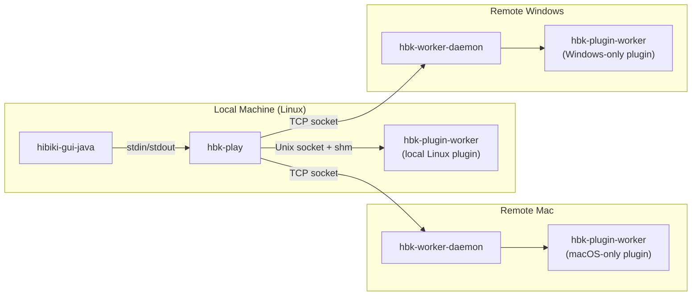

# Hibiki IPC Architecture

Hibiki uses three communication channels, each chosen for the specific
requirements of its communication pair.



## 1. GUI ↔ Backend (`hibiki-gui-java` ↔ `hbk-play`)

**Transport:** stdin/stdout pipes (length-prefixed protobuf)

**Why pipes?**
- **Simplicity**: The Java GUI spawns `hbk-play` as a single child
  process. Pipes are automatically created by `ProcessBuilder` — no
  port allocation, no socket path management, no cleanup.
- **Lifecycle**: Pipe EOF automatically signals process death.
- **Security**: No listening socket exposed.
- **Precedent**: Same pattern as LSP servers, `ffmpeg -f pipe:`.

**Protocol:**
- GUI→Engine: `pb.commands.Request` (framed protobuf)
- Engine→GUI: `pb.notifications.Notification` (framed protobuf)
- Framing: `uint32_t size` + `bytes[size]`

---

## 2. Backend ↔ Local Plugin Worker (Unix socket + shared memory)

**Transport:** Unix domain socket + POSIX shared memory

**Why sockets + shm?**
- **Multiple workers**: Each plugin runs in its own process.
- **Zero-copy audio**: Audio buffers (512 × 2ch × 4B = 4KB per block)
  use shared memory for real-time performance.
- **Crash isolation**: If a plugin crashes, only its worker dies.

**Protocol:**
- Host→Worker: `pb.worker.WorkerRequest` (framed protobuf over Unix socket)
- Worker→Host: `pb.worker.WorkerResponse` (framed protobuf)
- Audio data: POSIX shared memory (`shm_open`/`mmap`)

**Shared Memory Layout:**
```
Offset    Size           Content
0         64 B           Header (block_size, num_channels, flags)
64        N×4 B          Input L
64+N×4    N×4 B          Input R
64+N×8    N×4 B          Output L
64+N×12   N×4 B          Output R
```
Where N = `block_size` (default 512 samples).

---

## 3. Backend ↔ Remote Plugin Worker (TCP + inline audio)

**Transport:** TCP socket (commands + audio inline in protobuf)

**Why TCP with inline audio?**
- **Cross-machine**: Enables running macOS-only or Windows-only plugins
  from a Linux host.
- **No shared memory**: Shared memory doesn't work across machines.
  Audio is serialized as `bytes` in `ProcessAudio.input_audio` and
  `ProcessDone.output_audio` (channel-sequential float32, native endian).
- **Bandwidth**: At 512 samples × 2ch × 4B = 4KB per block, the audio
  overhead is ~180 KB/s at 44.1kHz — negligible over LAN.
- **Latency**: ~1-5ms round-trip on LAN, acceptable for non-realtime
  bouncing and tolerable for live playback.

**Protocol:**
- Same `WorkerRequest`/`WorkerResponse` protobuf as local mode
- Audio carried inline in proto `bytes` fields instead of shm
- `WorkerConfig` handshake sets block_size, num_channels, shm mode

**Audio byte layout in protobuf** (`input_audio` / `output_audio`):
```
Offset          Size        Content
0               N×4 B       Channel 0 (L) [N × float32]
N×4             N×4 B       Channel 1 (R) [N × float32]
────────────────────────────────────────
Total:          N×8 bytes   (e.g. 512 samples → 4096 bytes)
```
Channels are packed sequentially (not interleaved). Both sides
assume native byte order (little-endian on x86/ARM).

---

## POSIX → Windows API Mapping

The following table maps each POSIX API used in `worker_channel_posix.cpp`
to its Windows equivalent, for implementing `worker_channel_win32.cpp`:

### Command Channel (Unix socket → Named Pipe or TCP)

| Operation | POSIX (current) | Windows equivalent |
|-----------|------------------|--------------------|
| Create server | `socket(AF_UNIX, SOCK_STREAM, 0)` | `CreateNamedPipeA("\\\\.\\pipe\\hbk-plugin-XXX", ...)` or `socket(AF_INET, ...)` |
| Bind + Listen | `bind()` + `listen()` | Pipe: implicit in `CreateNamedPipe`. TCP: same as POSIX |
| Accept | `accept()` | Pipe: `ConnectNamedPipe(hPipe, NULL)`. TCP: `accept()` |
| Connect (client) | `connect()` | Pipe: `CreateFileA("\\\\.\\pipe\\hbk-plugin-XXX", ...)`. TCP: `connect()` |
| Send | `write(fd, buf, len)` | Pipe: `WriteFile(hPipe, buf, len, &written, NULL)`. TCP: `send()` |
| Receive | `read(fd, buf, len)` | Pipe: `ReadFile(hPipe, buf, len, &read, NULL)`. TCP: `recv()` |
| Close | `close(fd)` | Pipe: `CloseHandle(hPipe)`. TCP: `closesocket()` |
| Socket cleanup | `unlink(socket_path)` | Pipe: automatic. TCP: N/A |

### Shared Memory (POSIX shm → Windows File Mapping)

| Operation | POSIX (current) | Windows equivalent |
|-----------|------------------|--------------------|
| Create | `shm_open(name, O_CREAT \| O_RDWR, 0600)` | `CreateFileMappingA(INVALID_HANDLE_VALUE, NULL, PAGE_READWRITE, 0, size, name)` |
| Open (client) | `shm_open(name, O_RDWR, 0)` | `OpenFileMappingA(FILE_MAP_ALL_ACCESS, FALSE, name)` |
| Map | `mmap(NULL, size, PROT_READ \| PROT_WRITE, MAP_SHARED, fd, 0)` | `MapViewOfFile(hMap, FILE_MAP_ALL_ACCESS, 0, 0, size)` |
| Set size | `ftruncate(fd, size)` | Specified in `CreateFileMappingA` dwMaximumSizeLow parameter |
| Unmap | `munmap(ptr, size)` | `UnmapViewOfFile(ptr)` |
| Close | `close(fd)` | `CloseHandle(hMap)` |
| Remove | `shm_unlink(name)` | Automatic when all handles closed |

### Process Management

| Operation | POSIX (current) | Windows equivalent |
|-----------|------------------|--------------------|
| Spawn worker | `fork()` + `execl()` | `CreateProcessA(worker_path, args, ...)` |
| Kill worker | `kill(pid, SIGTERM)` | `TerminateProcess(hProcess, 0)` |
| Wait for exit | `waitpid(pid, &status, WNOHANG)` | `WaitForSingleObject(hProcess, 0)` |
| Auto-terminate on parent death | `prctl(PR_SET_PDEATHSIG, SIGTERM)` | Job Objects: `AssignProcessToJobObject()` with `JOB_OBJECT_LIMIT_KILL_ON_JOB_CLOSE` |

### Implementation Strategy for Windows

1. **Create `worker_channel_win32.hpp/cpp`** using named pipes + file mapping
2. Use `#ifdef _WIN32` in `plugin_proxy.cpp` to select the channel impl
3. The TCP channel (`worker_channel_tcp.cpp`) already works on Windows
   since it uses standard BSD sockets (`Winsock2.h` + `ws2_32.lib`)
4. For cross-platform builds, prefer TCP mode — it avoids all the
   platform-specific shared memory code

---

## Remote Worker Setup Guide

### Overview

Remote workers allow you to run VST3 plugins on different machines.
This enables:
- Running macOS AudioUnit/VST3 plugins from a Linux host
- Running Windows-only VST3 plugins from a Mac host
- Distributing CPU load across multiple machines (multi-server)

### On Each Remote Machine

1. **Build the daemon**:
   ```bash
   bazel build -c opt //:hbk-worker-daemon
   ```

2. **Run the daemon**:
   ```bash
   ./bazel-bin/hbk-worker-daemon --port 9100
   ```
   The daemon listens on port 9100 (configurable) and accepts
   connections from remote hosts. Each connection spawns a plugin
   instance in a worker thread.

3. **Install plugins** — place `.vst3` bundles in the standard
   VST3 directory (`/Library/Audio/Plug-Ins/VST3/` on macOS,
   `C:\Program Files\Common Files\VST3\` on Windows).

### On the Host Machine

1. Open **Settings → Plugins** tab
2. Set **Hosting Mode** to `Remote (TCP)`
3. Use **+** / **−** to add/remove hosts (e.g. `mac-studio:9100`, `win-pc:9100`)
4. Click **Apply**, then **Scan Remote** to discover available plugins
5. Remote plugins appear in the Browser under **📡 host:port** tree nodes

Plugins are distributed across configured servers using round-robin
assignment (see Multi-Server section below).

### Network Requirements

| Parameter | Value |
|-----------|-------|
| Protocol | TCP |
| Default port | 9100 |
| Bandwidth | ~180 KB/s per plugin at 44.1kHz/512 block |
| Latency | ~1-5ms LAN round-trip |
| Security | None (LAN-only, no auth) |
| Firewall | Allow TCP port 9100 inbound on remote |

### Troubleshooting

- **Connection refused**: Ensure `hbk-worker-daemon` is running and
  the firewall allows the port.
- **Plugin not found**: The plugin must be installed on the *remote*
  machine, not the host.
- **High latency**: Use wired Ethernet. WiFi adds jitter that can
  cause audio dropouts.
- **Scan shows no plugins**: Check that `.vst3` bundles exist under the
  daemon's standard search paths.

---

## Design Decision Summary

| Aspect         | GUI ↔ Backend   | Local Worker       | Remote Worker      |
|----------------|-----------------|--------------------|--------------------|
| Transport      | stdin/stdout    | Unix socket + shm  | TCP socket         |
| Audio transfer | N/A             | Shared memory      | Inline in protobuf |
| Multiplexing   | 1:1             | 1:N                | 1:N (multi-server) |
| Crash handling | EOF detection   | Socket break       | TCP break          |
| Cross-machine  | No              | No                 | Yes                |
| Platform       | Cross-platform  | Linux/macOS        | Cross-platform     |

---

## Wire Format Specification

### GUI ↔ Backend (stdin/stdout)

Messages are length-prefixed with a 4-byte magic header:

```
Bytes   Content
0-3     Magic: 0x48424B49 ("HBKI", little-endian)
4-7     Size: uint32_t payload length (little-endian)
8-N     Protobuf payload (Request or Notification)
```

The magic header prevents accidental deserialization of stray
stdout output (e.g. plugin debug prints). The Java GUI reads
stdout in a loop, skipping bytes until it finds the `HBKI` magic.

### Worker Channel (local + TCP)

Worker messages use a simpler 4-byte length prefix (no magic):

```
Bytes   Content
0-3     Size: uint32_t payload length (native endian)
4-N     Protobuf payload (WorkerRequest or WorkerResponse)
```

This is implemented in `WorkerChannel::sendMessage()` / `recvMessage()`.
Both local (Unix socket) and TCP channels use the same framing.

> **Note:** All integers use native byte order. Since both host and
> worker run on the same architecture (or at least matching endianness
> on LAN), no byte-swapping is needed. Cross-endian setups
> (e.g. big-endian PowerPC → x86) are not supported.

---

## Latency Analysis

### Per-Mode IPC Overhead

These are the IPC overhead costs *on top of* the inherent buffer
latency (`buffer_size / sample_rate`):

| Mode | IPC Overhead | Source |
|------|-------------|--------|
| **In-process** | 0 μs | Direct `IPlugin::process()` call |
| **Local sandbox** | 50–200 μs | `memcpy` to shm (4 KB) + Unix socket round-trip + protobuf ser/de (~1 KB) |
| **Remote TCP (LAN)** | 1–5 ms | TCP round-trip + protobuf ser/de + audio serialization (~8 KB) |
| **Remote TCP (WiFi)** | 3–15 ms | Variable jitter, packet loss possible |

### Total Latency by Buffer Size

`total = buffer_latency + IPC_overhead`

| Buffer Size | Buffer Latency (44.1kHz) | In-Process | Local Sandbox | Remote LAN |
|-------------|--------------------------|------------|---------------|------------|
| 64 samples  | 1.5 ms | 1.5 ms | 1.6 ms | 3–7 ms |
| 128 samples | 2.9 ms | 2.9 ms | 3.0 ms | 4–8 ms |
| 256 samples | 5.8 ms | 5.8 ms | 5.9 ms | 7–11 ms |
| **512 samples** | **11.6 ms** | **11.6 ms** | **11.7 ms** | **13–17 ms** |
| 1024 samples | 23.2 ms | 23.2 ms | 23.3 ms | 24–28 ms |
| 2048 samples | 46.4 ms | 46.4 ms | 46.5 ms | 47–51 ms |

> **Tip:** For live monitoring, use 128–256 samples in-process.
> For mixing/bouncing, 512+ with remote workers is fine since latency
> doesn't affect rendered output.

### Where Time Goes (Local Sandbox, 512 samples)

```
Host side:
  memcpy input → shm       ~5 μs   (4 KB, L1 cache hit)
  serialize ProcessAudio    ~20 μs  (protobuf, ~200 bytes cmd)
  send over Unix socket     ~10 μs  (kernel → kernel, no network)
                            ─────
                            ~35 μs

Worker side:
  recv + deserialize        ~15 μs
  VST3 plugin process()     ~200–5000 μs  (plugin-dependent)
  serialize ProcessDone     ~10 μs
  send response             ~10 μs
                            ─────
                            plugin_time + ~35 μs

Host side:
  recv + deserialize        ~15 μs
  memcpy output ← shm      ~5 μs
                            ─────
                            ~20 μs

Total IPC overhead: ~90 μs (excluding plugin processing)
```

---

## Bandwidth Requirements

Per plugin at 44.1 kHz, stereo (2 channels):

| Buffer Size | Blocks/sec | Audio Bytes/block | Command Overhead | **Total KB/s** |
|-------------|------------|-------------------|------------------|----------------|
| 64          | 689        | 512 B             | ~200 B           | **~491 KB/s**  |
| 128         | 345        | 1024 B            | ~200 B           | **~423 KB/s**  |
| 256         | 172        | 2048 B            | ~200 B           | **~387 KB/s**  |
| **512**     | **86**     | **4096 B**        | **~200 B**       | **~370 KB/s**  |
| 1024        | 43         | 8192 B            | ~200 B           | **~361 KB/s**  |
| 2048        | 22         | 16384 B           | ~200 B           | **~365 KB/s**  |

> For **local sandbox** mode, audio uses shared memory (zero network
> cost), so only the ~200 B command messages traverse the Unix socket —
> total overhead is negligible (~17 KB/s at 512 samples).

For multi-server with 10 remote plugins: ~3.7 MB/s — well within
gigabit Ethernet capacity (125 MB/s).

---

## TCP Socket Tuning

### `TCP_NODELAY` (Nagle's Algorithm)

Hibiki sets `TCP_NODELAY` on all worker connections to disable Nagle's
algorithm, which otherwise buffers small writes for up to 40ms:

```cpp
tcp_setsockopt(fd, IPPROTO_TCP, TCP_NODELAY, 1);
```

Without this, the ~200-byte command messages would be delayed
waiting for a full TCP segment, adding 10–40ms of artificial latency.

### Socket Buffer Sizes

The default OS socket buffer (usually 128 KB–256 KB) is sufficient.
At 512 samples, each round-trip transfers ~8.5 KB total — well
under the buffer limit. Increasing `SO_RCVBUF`/`SO_SNDBUF` is
unnecessary for typical plugin counts.

### Keepalive

Currently not configured. A daemon crash is detected when the next
`send()` or `recv()` fails. For long-idle connections, consider
enabling TCP keepalive:

```cpp
tcp_setsockopt(fd, SOL_SOCKET, SO_KEEPALIVE, 1);
// Linux-specific tuning:
tcp_setsockopt(fd, IPPROTO_TCP, TCP_KEEPIDLE, 60);   // seconds
tcp_setsockopt(fd, IPPROTO_TCP, TCP_KEEPINTVL, 10);
tcp_setsockopt(fd, IPPROTO_TCP, TCP_KEEPCNT, 3);
```

### Reconnection

Reconnection is not currently automatic. If a daemon crashes or the
network drops, `PluginProxy::isWorkerAlive()` returns `false` and
subsequent `process()` calls are no-ops. The user must reload the
plugin to re-establish the connection.

---

## Multi-Server Architecture

### Round-Robin Plugin Distribution

When multiple remote hosts are configured, `Track::LoadPlugin`
assigns each new plugin to a server using round-robin:

```cpp
// In track.cpp
size_t host_idx = plugins.size() % remote_hosts.size();
std::string selected = remote_hosts[host_idx];
```

This distributes plugins evenly across servers without requiring
load monitoring. Example with 3 servers and 6 plugins:

| Plugin # | Server |
|----------|--------|
| 0 | `mac-studio:9100` |
| 1 | `win-pc:9100` |
| 2 | `linux-render:9100` |
| 3 | `mac-studio:9100` |
| 4 | `win-pc:9100` |
| 5 | `linux-render:9100` |

### Remote Plugin Discovery

The `ScanRemotePlugins` command triggers parallel discovery:

1. Backend receives the command with `repeated string remote_hosts`
2. For each host, a detached thread:
   - Opens a TCP connection
   - Sends `WorkerConfig` handshake
   - Sends `ListPlugins` request
   - Receives `ListPluginsResult` response
   - Sends a `PluginListResponse` notification to the GUI with
     `remote_host` set to identify the source daemon
3. The GUI routes notifications to per-host tree nodes (`📡 host:port`)

### Limitations

- **No dynamic rebalancing**: Once a plugin is assigned to a server,
  it stays there until unloaded.
- **No failover**: If a server goes down, its plugins stop processing.
  The user must manually reload them.
- **Discovery is one-shot**: The GUI doesn't auto-refresh when daemons
  come online. Use **Scan Remote** to re-discover.
