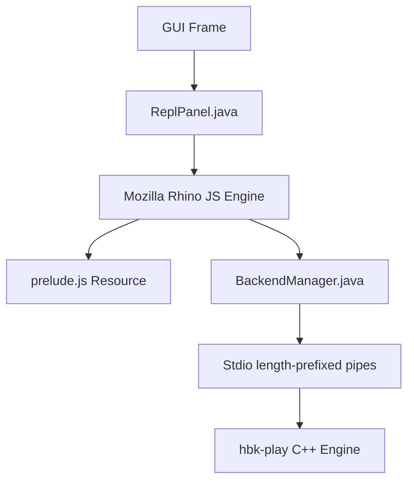

# JavaScript Scripting and REPL Manual

This document serves as both the **Design Document** and **User Manual** for the JavaScript scripting and live REPL capabilities in the Hibiki DAW.

---

## 1. Motivation & Overview

Adding JavaScript support to Hibiki brings a highly accessible, lightweight scripting environment into the DAW. It enables:
- **Interactive Development (REPL)**: Twisting GUI layouts, changing themes, and triggering playback live without restarting the application or losing state.
- **Generative Music & MIDI Composition**: Writing JS loops to programmatically build midi notes, arpeggiators, or complex Euclidean rhythm patterns.
- **Automation & Batch Operations**: Scripting file exports, bouncing projects, and managing tracks.

---

## 2. REPL-Driven Development Workflow

Hibiki features an embedded JavaScript console right in the GUI.

### Accessing the REPL
1. Launch the DAW GUI:
   ```bash
   bazel run //:hibiki-gui-java
   ```
2. Click the **JS REPL** button to toggle the JavaScript console panel, or click **λ REPL** (or press **Ctrl+R**) to toggle the Clojure console panel on the right.
3. Write your JavaScript code in the input area and press **Ctrl+Enter** (or **Cmd+Enter** on macOS) to evaluate it.
4. Use **Ctrl+↑** and **Ctrl+↓** to traverse the evaluation history.

---

## 3. Scripting API Reference (`prelude.js`)

Hibiki loads a helper API library automatically when the REPL starts. It exposes convenient global objects and functions.

### Global Objects
* `bm`: The `BackendManager` singleton instance, used to interact with the C++ audio engine.
* `theme`: The GUI `Theme` singleton, used for font/color settings.
* `session`: The `SessionView` component for clip grid interactions.
* `timeline`: The `TimelineView` component.

### Console Output
* `print(msg)`: Prints a message to the REPL output log.
* `console.log(msg)`: Equivalent alias for console log.
* `console.error(msg)`: Prints an error to the REPL output log.

### Transport Controls
* `play()`: Starts playback.
* `stop()`: Stops playback.
* `seek(beats)`: Seeks to the specified beat position (e.g., `seek(4.0)`).

### Track & Clip Management
* `loadClip(track, slot, path, loop)`: Loads an audio/MIDI clip into the session grid slot.
* `playClip(track, slot)`: Triggers a clip slot in session view.
* `stopTrack(track)`: Stops all playback on the given track index.
* `deleteClip(track, slot)`: Deletes a clip from a session slot.
* `setClipLoop(track, slot, loopBool)`: Toggles looping on a session clip.
* `addTimelineClip(track, path, startBeats, durationBeats)`: Places a clip on the timeline track.
* `removeTimelineClip(track, clipIndex)`: Removes a clip from the timeline.

### VST3 Plugins
* `loadPlugin(track, path, subPluginIndex)`: Loads a plugin onto a track (e.g., `loadPlugin(0, "testdata/Dexed.vst3")`).
* `removePlugin(track, pluginIndex)`: Removes a plugin from the track chain.
* `showPluginGui(track, pluginIndex)`: Opens the native window UI for a plugin.
* `setParam(track, pluginIndex, paramId, value)`: Sets a plugin parameter value (`0.0` - `1.0`).
* `listPlugins(path)`: Scans and prints all sub-plugins in a VST3 bundle.

### MIDI Programming
* `writeMidi(track, slot, clip, resolution, notesArray)`: Writes an array of MIDI notes to a clip. Notes are object maps: `{tick, pitch, dur, vel}`.
* `getMidi(track, slot, clip)`: Requests MIDI events from a clip (response is received via notification).

### Parameter Automation
* `addAutomation(track, pluginIndex, paramId)`: Adds an automation lane for a parameter.
* `removeAutomation(track, laneIndex)`: Removes an automation lane.
* `setAutomation(track, laneIndex, pointsArray)`: Updates automation points. Points are arrays of `[timeInBeats, value, tension]`.
* `getAutomation(track)`: Requests automation lanes for a track.

### Project & System
* `save(path)`: Saves the project to `.hbk` format.
* `load(path)`: Loads a project from `.hbk` format.
* `setBpm(bpm)`: Sets the project tempo.
* `undo()`: Undo the last change.
* `redo()`: Redo the last undone change.
* `bounce(path)`: Renders/exports the project output to a WAV file.
* `setTheme(presetName)`: Updates the GUI theme. Preset names: `"ableton-dark"`, `"ableton-light"`, `"solarized-dark"`, `"solarized-light"`, `"win95"`, `"winxp"`.

---

## 4. Scripting Examples

### Theme Customization
Change the theme preset instantly:
```javascript
setTheme("solarized-dark");
setTheme("win95");
### Generative Euclidean Rhythm & VST Rendering
Load a synthesizer VST, add a timeline clip, write a classic Euclidean kick pattern to it, and render/bounce the output to a WAV file:
```javascript
// 1. Load Dexed synthesizer on Track 1, slot 0
loadPlugin(1, "testdata/Dexed.vst3", 0);

// 2. Add a timeline clip on Track 1 at 0.0 seconds with duration 4.0 seconds
addTimelineClip(1, "testdata/test.mid", 0.0, 4.0);

// 3. Generate Bossa-like Euclidean kick rhythm
var PPQ = 480; // ticks per quarter note
var sixteenth = PPQ / 4;
var notes = [];
var pattern = [true, false, true, true, false, true, false, true];

for (var i = 0; i < pattern.length; i++) {
    if (pattern[i]) {
        notes.push({
            tick: i * sixteenth,
            pitch: 36, // Kick drum C1
            dur: sixteenth - 10,
            vel: 90
        });
    }
}

// 4. Write notes to the timeline clip 0
writeMidi(1, -1, 0, PPQ, notes);
print("Generated rhythm with " + notes.length + " events.");

// 5. Render/bounce the project outputs to output_mix.wav
bounce("output_mix.wav");
```

### Automatic Arpeggiator (Generative MIDI)
Create a C Major chord arpeggio progression:
```javascript
var PPQ = 480;
var chord = [60, 64, 67, 71]; // C E G B (Cmaj7)
var sixteenth = PPQ / 4;
var notes = [];

for (var bar = 0; bar < 4; bar++) {
    for (var step = 0; step < 16; step++) {
        var pitch = chord[(bar + step) % chord.length];
        notes.push({
            tick: (bar * 4 * PPQ) + (step * sixteenth),
            pitch: pitch,
            dur: sixteenth - 5,
            vel: (step % 4 === 0) ? 100 : 70
        });
    }
}

writeMidi(0, 0, -1, PPQ, notes);
play();
```

---

## 5. Design & Implementation Details



### Scripting Engine Selection
We use **Mozilla Rhino** embedded within the Java GUI application:
- **Low Footprint**: Standard library dependency with zero transitive native image configuration requirements.
- **Java Interop**: Rhino's `Packages` prefix and automatic type conversion allow seamless access to Protobuf-generated builders, Swing panels, and Java API models.

### Classpath Resource Loading
The helper functions (`play()`, `stop()`, etc.) are bundled in a `/prelude.js` classpath resource (located in `src/main/resources/prelude.js`). It is loaded and executed inside a persistent standard scope when the REPL panel is initialized.

### Stdout & Stderr Capture
Rhino's script execution is wrapped inside a custom thread redirection wrapper in `ReplPanel.doEval()`. Standard output prints (`print()`, `console.log()`) call `java.lang.System.out.println()`, which is intercepted by the panel's custom output print stream and written directly back into the REPL's output text area.
