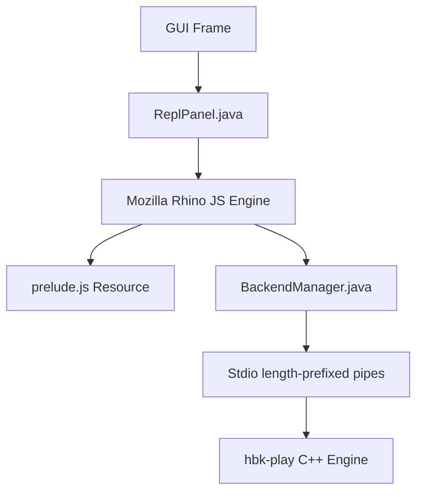

# JavaScript Scripting and REPL Manual

This document serves as both the **Design Document** and **User Manual** for the JavaScript scripting and live REPL capabilities in the Hibiki DAW.

---

## 1. Motivation & Overview

Adding JavaScript support to Hibiki brings a highly accessible, lightweight scripting environment into the DAW. It enables:
- **Interactive Development (REPL)**: Twisting GUI layouts, changing themes, and triggering playback live without restarting the application or losing state.
- **Generative Music & MIDI Composition**: Writing JS loops to programmatically build midi notes, arpeggiators, or complex Euclidean rhythm patterns.
- **Automation & Batch Operations**: Scripting file exports, bouncing projects, and managing tracks.

---

## 2. REPL-Driven Development Workflow

Hibiki features an embedded JavaScript console right in the GUI.

### Accessing the REPL
1. Launch the DAW GUI:
   ```bash
   bazel run //:hibiki-gui-java
   ```
2. Click the **JS REPL** button to toggle the JavaScript console panel, or click **λ REPL** (or press **Ctrl+R**) to toggle the Clojure console panel on the right.
3. Write your JavaScript code in the input area and press **Ctrl+Enter** (or **Cmd+Enter** on macOS) to evaluate it.
4. Use **Ctrl+↑** and **Ctrl+↓** to traverse the evaluation history.

---

## 3. Scripting API Reference (`prelude.js`)

Hibiki loads a helper API library automatically when the REPL starts. It exposes convenient global objects and functions.

### Global Objects
* `bm`: The `BackendManager` singleton instance, used to interact with the C++ audio engine.
* `theme`: The GUI `Theme` singleton, used for font/color settings.
* `session`: The `SessionView` component for clip grid interactions.
* `timeline`: The `TimelineView` component.

### Console Output
* `print(msg)`: Prints a message to the REPL output log.
* `console.log(msg)`: Equivalent alias for console log.
* `console.error(msg)`: Prints an error to the REPL output log.

### Transport Controls
* `play()`: Starts playback.
* `stop()`: Stops playback.
* `seek(beats)`: Seeks to the specified beat position (e.g., `seek(4.0)`).

### Track & Clip Management
* `loadClip(track, slot, path, loop)`: Loads an audio/MIDI clip into the session grid slot.
* `playClip(track, slot)`: Triggers a clip slot in session view.
* `stopTrack(track)`: Stops all playback on the given track index.
* `deleteClip(track, slot)`: Deletes a clip from a session slot.
* `setClipLoop(track, slot, loopBool)`: Toggles looping on a session clip.
* `addTimelineClip(track, path, startBeats, durationBeats)`: Places a clip on the timeline track.
* `removeTimelineClip(track, clipIndex)`: Removes a clip from the timeline.

### VST3 Plugins
* `loadPlugin(track, path, subPluginIndex)`: Loads a plugin onto a track (e.g., `loadPlugin(0, "testdata/Dexed.vst3")`).
* `removePlugin(track, pluginIndex)`: Removes a plugin from the track chain.
* `showPluginGui(track, pluginIndex)`: Opens the native window UI for a plugin.
* `setParam(track, pluginIndex, paramId, value)`: Sets a plugin parameter value (`0.0` - `1.0`).
* `listPlugins(path)`: Scans and prints all sub-plugins in a VST3 bundle.

### MIDI Programming
* `writeMidi(track, slot, clip, resolution, notesArray)`: Writes an array of MIDI notes to a clip. Notes are object maps: `{tick, pitch, dur, vel}`.
* `getMidi(track, slot, clip)`: Requests MIDI events from a clip (response is received via notification).

### Parameter Automation
* `addAutomation(track, pluginIndex, paramId)`: Adds an automation lane for a parameter.
* `removeAutomation(track, laneIndex)`: Removes an automation lane.
* `setAutomation(track, laneIndex, pointsArray)`: Updates automation points. Points are arrays of `[timeInBeats, value, tension]`.
* `getAutomation(track)`: Requests automation lanes for a track.

### Project & System
* `save(path)`: Saves the project to `.hbk` format.
* `load(path)`: Loads a project from `.hbk` format.
* `setBpm(bpm)`: Sets the project tempo.
* `undo()`: Undo the last change.
* `redo()`: Redo the last undone change.
* `bounce(path)`: Renders/exports the project output to a WAV file.
* `setTheme(presetName)`: Updates the GUI theme. Preset names: `"ableton-dark"`, `"ableton-light"`, `"solarized-dark"`, `"solarized-light"`, `"win95"`, `"winxp"`.

---

## 4. Scripting Examples

### Theme Customization
Change the theme preset instantly:
```javascript
setTheme("solarized-dark");
setTheme("win95");
```

### TypeScript REPL Snippets

Hibiki can compile a marked TypeScript REPL snippet to ES5 JavaScript before evaluating it in Rhino. Put `// @ts` on the first non-whitespace line. The bundled declarations cover the current prelude API, including MIDI note and automation-point types.

TypeScript compilation uses the `tsc` executable on `PATH`. Install it with your system's Node.js/TypeScript toolchain, or point Hibiki to it with `-Dhibiki.typescript.command=/absolute/path/to/tsc`.

```typescript
// @ts
const PPQ: number = 480;
const notes: MidiNote[] = [
  { tick: 0, pitch: 60, dur: PPQ, vel: 100 },
  { tick: PPQ, pitch: 64, dur: PPQ, vel: 100 },
];

writeMidi(0, 0, -1, PPQ, notes);
play();
```

The TypeScript compiler only type-checks the submitted snippet. Runtime state remains the persistent Rhino scope, so use JavaScript-compatible ES5 output and do not rely on type checking to remember declarations from previous evaluations.

Typed SDK examples live in `examples/sdk/`: `midi-arpeggiator.ts` generates a session-clip arpeggio and `acid-house.ts` builds and renders a short bassline. Once the project TypeScript dependency is installed, check them with `npm run check:sdk`.

### Bazel TypeScript Build

Bazel is the source of truth for TypeScript compilation and checking. The npm metadata is only a package description for the pinned TypeScript compiler; developers and CI should invoke Bazel targets rather than calling `tsc` or npm scripts directly.

The current and planned targets are:

```text
//:sdk_typescript_check  # Current Bazel type-check for declarations and examples
//sdk:prelude            # Planned: compile the typed SDK implementation to ES5 prelude.js
//sdk:check              # Planned: strict SDK/public declaration check
//examples/sdk:all       # Planned: dedicated example target
//:js_repl_test      # Exercise the generated prelude through Rhino and IPC
```

The intended build pipeline is:

```text
src/main/typescript/hibiki-sdk.ts
        ↓ Bazel + pinned TypeScript toolchain
src/main/resources/prelude.js      # generated ES5 output
        ↓ Rhino
embedded JS/TypeScript REPL
```

`prelude.js` is a generated compatibility artifact and must not become the source of the public API again. Public interfaces, MIDI note types, track/clip/device handles, and SDK examples belong in TypeScript. Rhino receives the compiler's ES5 output because it does not parse TypeScript directly.

The Bazel implementation should use a Bzlmod-managed TypeScript ruleset such as `aspect_rules_ts` and its `ts_project` rule. The compiler version, ruleset version, `tsconfig`, generated outputs, and example checks must be pinned and included in the Bazel dependency graph so local and CI builds are reproducible.

The Bazel TypeScript toolchain is now wired into `MODULE.bazel`; run `bazel build -c opt //:sdk_typescript_check` to check the current declarations and examples. The existing `npm run check:sdk` command remains an interim convenience only and is not the release or CI build path.

### Generative Euclidean Rhythm & VST Rendering
Load a synthesizer VST, add a timeline clip, write a classic Euclidean kick pattern to it, and render/bounce the output to a WAV file:
```javascript
// 1. Load Dexed synthesizer on Track 1, slot 0
loadPlugin(1, "testdata/Dexed.vst3", 0);

// 2. Add a timeline clip on Track 1 at 0.0 seconds with duration 4.0 seconds
addTimelineClip(1, "testdata/test.mid", 0.0, 4.0);

// 3. Generate Bossa-like Euclidean kick rhythm
var PPQ = 480; // ticks per quarter note
var sixteenth = PPQ / 4;
var notes = [];
var pattern = [true, false, true, true, false, true, false, true];

for (var i = 0; i < pattern.length; i++) {
    if (pattern[i]) {
        notes.push({
            tick: i * sixteenth,
            pitch: 36, // Kick drum C1
            dur: sixteenth - 10,
            vel: 90
        });
    }
}

// 4. Write notes to the timeline clip 0
writeMidi(1, -1, 0, PPQ, notes);
print("Generated rhythm with " + notes.length + " events.");

// 5. Render/bounce the project outputs to output_mix.wav
bounce("output_mix.wav");
```

### Automatic Arpeggiator (Generative MIDI)
Create a C Major chord arpeggio progression:
```javascript
var PPQ = 480;
var chord = [60, 64, 67, 71]; // C E G B (Cmaj7)
var sixteenth = PPQ / 4;
var notes = [];

for (var bar = 0; bar < 4; bar++) {
    for (var step = 0; step < 16; step++) {
        var pitch = chord[(bar + step) % chord.length];
        notes.push({
            tick: (bar * 4 * PPQ) + (step * sixteenth),
            pitch: pitch,
            dur: sixteenth - 5,
            vel: (step % 4 === 0) ? 100 : 70
        });
    }
}

writeMidi(0, 0, -1, PPQ, notes);
play();
```

---

## 5. Design & Implementation Details



### Scripting Engine Selection
We use **Mozilla Rhino** embedded within the Java GUI application:
- **Low Footprint**: Standard library dependency with zero transitive native image configuration requirements.
- **Java Interop**: Rhino's `Packages` prefix and automatic type conversion allow seamless access to Protobuf-generated builders, Swing panels, and Java API models.

### Classpath Resource Loading
The helper functions (`play()`, `stop()`, etc.) are bundled in a `/prelude.js` classpath resource (located in `src/main/resources/prelude.js`). It is loaded and executed inside a persistent standard scope when the REPL panel is initialized.

### Stdout & Stderr Capture
Rhino's script execution is wrapped inside a custom thread redirection wrapper in `ReplPanel.doEval()`. Standard output prints (`print()`, `console.log()`) call `java.lang.System.out.println()`, which is intercepted by the panel's custom output print stream and written directly back into the REPL's output text area.

---

## 6. SDK Direction and Architecture Decisions

The current prelude is intentionally a small command layer over protobuf IPC. It is useful for interactive scripting, but it is not yet a complete DAW SDK: most calls are fire-and-forget, scripts use positional indices, and engine notifications are not exposed as ergonomic JavaScript events.

The next SDK work follows this order:

1. **Harden the embedded runtime.** Serialize evaluations, make initialization readiness explicit, avoid process-global output capture, and provide structured errors and disposable listeners.
2. **Add a JavaScript object facade over the existing engine API.** Prefer domain objects such as `hibiki.transport`, `track`, `clip`, and `device` over direct protobuf builders and positional helper arguments.
3. **Expose existing engine capabilities.** Prioritize mixer/routing, recording and input selection, arrangement editing, modulation, plugin bypass/reorder/sidechain, and MIDI panic before introducing new engine commands.
4. **Provide synchronized state and events.** Build a client-side state store from `FullSync`, `StateUpdate`, playhead, parameter, and metering notifications.
5. **Design correlated asynchronous operations.** Add a request identifier to commands and their acknowledgements/results before promising `await` semantics. The existing IPC protocol does not yet correlate a request with a response.
6. **Ship typed scripting ergonomics.** The embedded TypeScript path added above is the first step. It should evolve into a versioned declaration package generated from the public facade, not from protobuf internals.
7. **Evaluate an external extension host later.** Node.js/TypeScript extensions, packaging, permissions, hot reload, and UI contributions should follow a proven object API; Rhino remains the interactive REPL and compatibility path during that transition.

Stable entity IDs are a later persistence and protocol migration. Until then, SDK handles should clearly document that index-based references can become invalid after project-state changes. Likewise, direct Rhino `Packages` access remains an advanced, unsupported escape hatch rather than part of the future public SDK.

---

## 7. Handover Notes

This section records the implementation state as of 2026-08-01 so work can resume without repeating the repository review.

### Completed

- Replaced the public global helper API in `prelude.js` with a `hibiki` namespace for transport, tracks, session slots, arrangement clips, MIDI, devices, mixer controls, projects, and themes.
- Migrated the focused Rhino integration test to the new namespace and made its MIDI assertion deterministic by checking the emitted command.
- Added the canonical TypeScript contract in `src/main/typescript/hibiki-sdk.ts` and declarations in `src/main/resources/hibiki.d.ts`.
- Added typed examples in `examples/sdk/midi-arpeggiator.ts` and `examples/sdk/acid-house.ts`.
- Added the Bazel TypeScript checking target:

  ```bash
  bazel build -c opt //:sdk_typescript_check
  ```

- The focused `//:js_repl_test` passed after the façade migration. Formatting and `git diff --check` also passed.

### Incomplete

- `src/main/resources/prelude.js` is still hand-authored JavaScript. Move the runtime bridge into TypeScript and make Bazel generate the ES5 prelude.
- The current TypeScript target checks declarations and examples but does not generate `prelude.js`.
- Earlier documentation snippets still use removed global functions and must be migrated to `hibiki.*` syntax.
- The arpeggiator and acid-house examples are not yet automated audio-render E2E tests.
- Async calls still use fire-and-forget notifications. Add request IDs and correlated acknowledgements before exposing Promise-based query methods.
- Rhino evaluation still needs serialized execution, explicit initialization readiness, and non-global output capture.

### Recommended next sequence

1. Make the TypeScript contract the actual runtime implementation and keep protobuf/`Packages` access private.
2. Change the Bazel target from type-check-only to emit ES5 JavaScript for the Java GUI resource path.
3. Add a generated-prelude Rhino verification test.
4. Migrate all documentation snippets to `hibiki.*` syntax.
5. Add an acid-house E2E test that writes bass MIDI, loads a synth, renders WAV, and verifies non-silent output.
6. Add request correlation, state caching, event subscriptions, and typed async results.

### Verification commands

```bash
bazel build -c opt //:sdk_typescript_check
bazel test -c opt //:js_repl_test --test_output=errors
bazel test -c opt //:typescript_compiler_test --test_output=errors
./tools/format.sh
git diff --check
```
