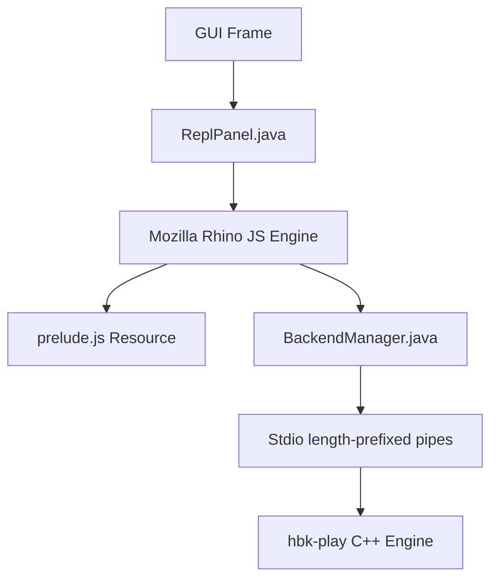

# JavaScript Scripting and REPL Manual

This document serves as both the **Design Document** and **User Manual** for the JavaScript scripting and live REPL capabilities in the Hibiki DAW.

---

## 1. Motivation & Overview

Adding JavaScript support to Hibiki brings a highly accessible, lightweight scripting environment into the DAW. It enables:
- **Interactive Development (REPL)**: Twisting GUI layouts, changing themes, and triggering playback live without restarting the application or losing state.
- **Generative Music & MIDI Composition**: Writing JS loops to programmatically build midi notes, arpeggiators, or complex Euclidean rhythm patterns.
- **Automation & Batch Operations**: Scripting file exports, bouncing projects, and managing tracks.

---

## 2. REPL-Driven Development Workflow

Hibiki features an embedded JavaScript console right in the GUI.

### Accessing the REPL
1. Launch the DAW GUI:
   ```bash
   bazel run //:hibiki-gui-java
   ```
2. Click the **JS REPL** button to toggle the JavaScript console panel, or click **λ REPL** (or press **Ctrl+R**) to toggle the Clojure console panel on the right.
3. Write your JavaScript code in the input area and press **Ctrl+Enter** (or **Cmd+Enter** on macOS) to evaluate it.
4. Use **Ctrl+↑** and **Ctrl+↓** to traverse the evaluation history.

---

## 3. Scripting API Reference (`prelude.js`)

Hibiki loads the `hibiki` SDK namespace automatically when the REPL starts. The public API is deliberately independent of Rhino's Java interop.

### Public Namespace

* `hibiki`: The supported scripting SDK. Use its transport, tracks, project, and theme members below.
* Rhino `Packages` access and Java UI/backend objects are implementation details, not a supported SDK surface.

### Console Output
* `print(msg)`: Prints a message to the REPL output log.
* `console.log(msg)`: Equivalent alias for console log.
* `console.error(msg)`: Prints an error to the REPL output log.

### Transport Controls
* `hibiki.transport.play()`: Starts playback.
* `hibiki.transport.stop()`: Stops playback.
* `hibiki.transport.seek(position)`: Seeks to the specified position.

### Track & Clip Management
* `hibiki.tracks.at(track).session.slot(slot).load(path, loop)`: Loads a clip.
* `hibiki.tracks.at(track).session.slot(slot).play()`: Triggers a session clip.
* `hibiki.tracks.at(track).session.slot(slot).remove()`: Deletes a session clip.
* `hibiki.tracks.at(track).arrangement.addClip(path, start, duration)`: Places an arrangement clip.
* `hibiki.tracks.at(track).arrangement.clip(index).remove()`: Removes an arrangement clip.

### VST3 Plugins
* `hibiki.tracks.at(track).devices.load(path, index)`: Loads a plugin.
* `hibiki.tracks.at(track).devices.at(index).remove()`: Removes a device.
* `hibiki.tracks.at(track).devices.at(index).showGui()`: Opens the native plugin UI.
* `hibiki.tracks.at(track).devices.at(index).parameter(id).set(value)`: Sets a normalized parameter.

### MIDI Programming
* `hibiki.tracks.at(track).session.slot(slot).midi.replaceNotes(resolution, notes)`: Writes MIDI notes.
* `hibiki.tracks.at(track).arrangement.clip(index).midi.get()`: Requests arrangement MIDI data.

### Project & System
* `hibiki.project.save(path)`: Saves the project to `.hbk` format.
* `hibiki.project.load(path)`: Loads a project from `.hbk` format.
* `hibiki.project.setBpm(bpm)`: Sets the project tempo.
* `hibiki.project.undo()` / `hibiki.project.redo()`: Undo or redo changes.
* `hibiki.project.bounce(path)`: Renders the project output to WAV.
* `hibiki.theme.set(presetName)`: Updates the GUI theme.

---

## 4. Scripting Examples

### Theme Customization
Change the theme preset instantly:
```javascript
hibiki.theme.set("SOLARIZED_DARK");
hibiki.theme.set("WIN95");
```

### TypeScript REPL Snippets

Hibiki can compile a marked TypeScript REPL snippet to ES5 JavaScript before evaluating it in Rhino. Put `// @ts` on the first non-whitespace line. The bundled declarations cover the current `hibiki` API, including MIDI-note types.

When launched with Bazel, the GUI uses its bundled, pinned TypeScript compiler—no global `tsc` installation is needed. For a non-Bazel launch or a custom compiler, set `-Dhibiki.typescript.command=/absolute/path/to/tsc`.

```typescript
// @ts
const PPQ: number = 480;
const notes: MidiNote[] = [
  { tick: 0, pitch: 60, dur: PPQ, vel: 100 },
  { tick: PPQ, pitch: 64, dur: PPQ, vel: 100 },
];

hibiki.tracks.at(0).session.slot(0).midi.replaceNotes(PPQ, notes);
hibiki.transport.play();
```

The TypeScript compiler only type-checks the submitted snippet. Runtime state remains the persistent Rhino scope, so use JavaScript-compatible ES5 output and do not rely on type checking to remember declarations from previous evaluations.

Typed SDK examples live in `examples/sdk/`: `midi-arpeggiator.ts` generates a session-clip arpeggio and `acid-house.ts` builds and renders a short bassline. Check them with `bazel build -c opt //:sdk_typescript_check`.

### Bazel TypeScript Build

Bazel is the source of truth for repository TypeScript checking. The npm metadata is only a package description for the pinned TypeScript compiler; developers and CI should invoke Bazel targets rather than calling `tsc` or npm scripts directly.

When launched with Bazel, the interactive REPL uses the pinned TypeScript compiler through a Bazel runfiles launcher. Bazel compiles the TypeScript runtime bridge to the Rhino-compatible `prelude.js` resource and generates the SDK declarations used by the REPL.

The current and planned targets are:

```text
//:sdk_typescript_check  # Current Bazel type-check for declarations and examples
//sdk:prelude            # Planned: compile the typed SDK implementation to ES5 prelude.js
//sdk:check              # Planned: strict SDK/public declaration check
//examples/sdk:all       # Planned: dedicated example target
//:js_repl_test      # Exercise the generated prelude through Rhino and IPC
```

The current build pipeline is:

```text
src/main/typescript/hibiki-sdk.ts ──> generated hibiki-sdk.d.ts ──┐
        │                                                         ├── REPL type-checking
        └── type-check examples/sdk/*.ts                          │
                                                                  │
src/main/typescript/prelude.ts ──> generated prelude.js ──────────┴── embedded Rhino REPL
```

`prelude.js` and `hibiki-sdk.d.ts` are generated compatibility artifacts, rather than sources of the public API. `hibiki-globals.d.ts` is intentionally tiny: it only binds the generated `HibikiSdk` type to the REPL's `hibiki` global and declares `print`. Public interfaces, MIDI note types, track/clip/device handles, and SDK examples belong in TypeScript. Rhino receives the compiler's ES5 output because it does not parse TypeScript directly.

Hibiki uses its small repository-owned `ts_check` rule with a Bzlmod-managed hermetic Node toolchain and an integrity-pinned TypeScript tarball. The compiler version, `tsconfig`, generated outputs, and example checks are included in the Bazel dependency graph so local and CI builds are reproducible without Aspect rules or telemetry.

The Bazel TypeScript toolchain is now wired into `MODULE.bazel`; run `bazel build -c opt //:sdk_typescript_check` to check the current declarations and examples. The existing `npm run check:sdk` command remains an interim convenience only and is not the release or CI build path.

### Generative Euclidean Rhythm & VST Rendering
Load a synthesizer VST, add a timeline clip, write a classic Euclidean kick pattern to it, and render/bounce the output to a WAV file:
```javascript
// 1. Load Dexed synthesizer on Track 1, slot 0
hibiki.tracks.at(1).devices.load("testdata/Dexed.vst3", 0);

// 2. Add a timeline clip on Track 1 at 0.0 seconds with duration 4.0 seconds
hibiki.tracks.at(1).arrangement.addClip("testdata/test.mid", 0.0, 4.0);

// 3. Generate Bossa-like Euclidean kick rhythm
var PPQ = 480; // ticks per quarter note
var sixteenth = PPQ / 4;
var notes = [];
var pattern = [true, false, true, true, false, true, false, true];

for (var i = 0; i < pattern.length; i++) {
    if (pattern[i]) {
        notes.push({
            tick: i * sixteenth,
            pitch: 36, // Kick drum C1
            dur: sixteenth - 10,
            vel: 90
        });
    }
}

// 4. Write notes to the timeline clip 0
hibiki.tracks.at(1).arrangement.clip(0).midi.replaceNotes(PPQ, notes);
print("Generated rhythm with " + notes.length + " events.");

// 5. Render/bounce the project outputs to output_mix.wav
hibiki.project.bounce("output_mix.wav");
```

### Automatic Arpeggiator (Generative MIDI)
Create a C Major chord arpeggio progression:
```javascript
var PPQ = 480;
var chord = [60, 64, 67, 71]; // C E G B (Cmaj7)
var sixteenth = PPQ / 4;
var notes = [];

for (var bar = 0; bar < 4; bar++) {
    for (var step = 0; step < 16; step++) {
        var pitch = chord[(bar + step) % chord.length];
        notes.push({
            tick: (bar * 4 * PPQ) + (step * sixteenth),
            pitch: pitch,
            dur: sixteenth - 5,
            vel: (step % 4 === 0) ? 100 : 70
        });
    }
}

hibiki.tracks.at(0).session.slot(0).midi.replaceNotes(PPQ, notes);
hibiki.transport.play();
```

---

## 5. Design & Implementation Details



### Scripting Engine Selection
We use **Mozilla Rhino** embedded within the Java GUI application:
- **Low Footprint**: Standard library dependency with zero transitive native image configuration requirements.
- **Java Interop**: Rhino's `Packages` prefix and automatic type conversion allow seamless access to Protobuf-generated builders, Swing panels, and Java API models.

### Classpath Resource Loading
The `hibiki` compatibility facade is bundled in a generated `/prelude.js` classpath resource. Bazel compiles `src/main/typescript/prelude.ts` to ES5, and the REPL loads that resource into a persistent standard scope when initialized.

### Stdout & Stderr Capture
Rhino's script execution is wrapped inside a custom thread redirection wrapper in `ReplPanel.doEval()`. Standard output prints (`print()`, `console.log()`) call `java.lang.System.out.println()`, which is intercepted by the panel's custom output print stream and written directly back into the REPL's output text area.

---

## 6. SDK Direction and Architecture Decisions

The current prelude is intentionally a small command layer over protobuf IPC. It is useful for interactive scripting, but it is not yet a complete DAW SDK: most calls are fire-and-forget, scripts use positional indices, and engine notifications are not exposed as ergonomic JavaScript events.

The next SDK work follows this order:

1. **Harden the embedded runtime.** Serialize evaluations, make initialization readiness explicit, avoid process-global output capture, and provide structured errors and disposable listeners.
2. **Add a JavaScript object facade over the existing engine API.** Prefer domain objects such as `hibiki.transport`, `track`, `clip`, and `device` over direct protobuf builders and positional helper arguments.
3. **Expose existing engine capabilities.** Prioritize mixer/routing, recording and input selection, arrangement editing, modulation, plugin bypass/reorder/sidechain, and MIDI panic before introducing new engine commands.
4. **Provide synchronized state and events.** Build a client-side state store from `FullSync`, `StateUpdate`, playhead, parameter, and metering notifications.
5. **Design correlated asynchronous operations.** Add a request identifier to commands and their acknowledgements/results before promising `await` semantics. The existing IPC protocol does not yet correlate a request with a response.
6. **Ship typed scripting ergonomics.** The embedded TypeScript path added above is the first step. It should evolve into a versioned declaration package generated from the public facade, not from protobuf internals.
7. **Evaluate an external extension host later.** Node.js/TypeScript extensions, packaging, permissions, hot reload, and UI contributions should follow a proven object API; Rhino remains the interactive REPL and compatibility path during that transition.

Stable entity IDs are a later persistence and protocol migration. Until then, SDK handles should clearly document that index-based references can become invalid after project-state changes. Likewise, direct Rhino `Packages` access remains an advanced, unsupported escape hatch rather than part of the future public SDK.

---

## 7. SDK Capability Gap and Roadmap

The closest Ableton comparison is the Max for Live Live Object Model and Live API, rather than a single standalone SDK. It exposes a navigable hierarchy of songs, tracks, clip slots, clips, devices, parameters, scenes, and control surfaces; clients can query state, set properties, invoke functions, and observe changes.

Hibiki's current `hibiki` namespace is intentionally smaller. The following capabilities are the most important gaps to close before claiming Ableton-level scripting ergonomics.

1. **Async completion and ordering.** Commands such as device loading, MIDI writing, and bouncing are currently fire-and-forget. Add Promise-returning operations with acknowledgements, typed failures, and timeouts: `await device.load(...)`, `await clip.replaceNotes(...)`, and `await project.bounce(...)`.
2. **Queries and cached state.** Add reads for project tempo, track lists and names, clips and notes, device parameters, and mixer values. A practical SDK must inspect a set as well as mutate it.
3. **Subscriptions.** Add typed change events such as `track.on("volume", listener)`, `clip.on("playing", listener)`, and `project.on("tempo", listener)`. This requires IPC request IDs and state-change notifications.
4. **Stable handles.** Index-based references such as `tracks.at(0)` and `arrangement.clip(0)` break when users reorder or delete objects. Introduce object IDs, canonical paths, existence checks, and lifecycle-aware `TrackHandle`, `ClipHandle`, and `DeviceHandle` values.
5. **Session workflow.** Model scenes, clip-slot launch/stop, quantization, follow actions, selected slots, and coordinated multi-track launch.
6. **Arrangement workflow.** Support clip enumeration, move/duplicate/split, loop/warp settings, loop regions, cue points, tempo automation, and time signatures.
7. **Device and rack model.** Expose parameter enumeration, names, ranges, units, defaults, automation state, bypass, chains, macros, drum pads, and return chains—not only parameter writes.
8. **Mixer and routing.** Add sends/returns, master/cue controls, crossfader assignment, monitoring, arm/solo, input/output routing, freeze, and flatten operations.
9. **Automation and modulation.** Add read/write automation curves, lane enumeration, clip envelopes, modulation, and safe real-time parameter control.
10. **Undo transactions.** Provide `project.transaction(name, async () => { ... })` so a multi-step script becomes one undo operation and can fail atomically.
11. **Richer MIDI.** Add note selection/query, CC, MPE/expression, clip loop and launch settings, recording, capture MIDI, scales, and groove operations.
12. **Extension host and controllers.** Later, add MIDI mapping, control-surface integration, persistent extension state, permissions, hot reload, and UI contributions.

### Recommended implementation order

Prioritize completion acknowledgements, query APIs, subscriptions, stable handles, and transactions. Without these foundations, complex scripts cannot reliably sequence operations. The acid-house example demonstrates the problem: a successful offline bounce requires an arrangement MIDI clip, a loaded instrument, written notes, and a confirmed render; sending those commands without lifecycle guarantees is not a robust SDK contract.

### API semantics and design rules

Feature coverage alone is not enough. The SDK should adopt these rules before expanding its surface area.

1. **Commands are asynchronous by default.** Any operation that crosses the engine boundary returns `Promise<T>`. A resolved Promise means the engine accepted and applied the operation; it must not mean merely that a request was queued.
2. **Queries return snapshots; subscriptions report change.** `await track.getState()` returns an immutable snapshot with a revision number. `track.onChange(listener)` reports subsequent changes. Do not expose mutable local caches as if they were engine truth.
3. **Handles have stable identity and explicit validity.** Handles carry an engine ID and canonical path. After deletion or project reload, operations reject with a typed `StaleHandleError`; they must never silently target a new object at the old index.
4. **Indexes are selection helpers, not identity.** `tracks.at(0)` and `clipSlots.at(0)` are convenient lookups only. APIs that create objects return their new handle directly.
5. **Creation is explicit.** `session.slot(0).createMidiClip({ lengthBeats: 4 })` and `arrangement.createMidiClip(...)` make lifecycle visible. `replaceNotes` updates an existing MIDI clip and must reject an empty slot rather than creating hidden state.
6. **Mutations are idempotent where possible.** Methods such as `setVolume`, `setMuted`, and `replaceNotes` set a complete target state. Separate non-idempotent commands such as `launch`, `duplicate`, and `record` clearly use verbs.
7. **Transactions define undo and failure semantics.** `project.transaction("Create acid bassline", async () => { ... })` creates one undo step. If a nested command fails, the transaction rejects and either rolls back or reports exactly which partial effects remain.
8. **Errors are typed and actionable.** Use errors such as `NotFoundError`, `InvalidStateError`, `UnsupportedOperationError`, `TimeoutError`, and `EngineError`, each containing a stable error code, affected handle/path, and engine detail.
9. **Events are ordered and recoverable.** Events include a monotonically increasing revision. Consumers can detect gaps and call a resynchronization query instead of operating on silently stale state.
10. **Use units and normalized values consistently.** Name units in fields and arguments: `positionBeats`, `lengthBeats`, `tick`, `normalizedValue`, `db`, and `seconds`. Do not overload a bare `value` or mix beats and seconds without conversion APIs.
11. **TypeScript is the public contract.** Export public interfaces, readonly snapshots, discriminated event unions, and branded IDs from one package. Keep protobuf classes, Rhino `Packages`, and UI implementation details private to the runtime bridge.
12. **Compatibility is deliberate.** Version the SDK, deprecate methods before removal, and publish capability checks for optional engine/device features. Scripts should be able to test support without parsing error text.

Illustrative shape:

```typescript
await project.transaction("Create acid bassline", async () => {
  const track = await project.tracks.getOrCreateMidiTrack("Acid Bass");
  const device = await track.devices.load("builtin://3xosc");
  const clip = await track.arrangement.createMidiClip({ positionBeats: 0, lengthBeats: 4 });
  await clip.replaceNotes(notes);
  await device.ready;
  await project.setTempo(128);
  await project.bounce({ path: "acid-house.wav" });
});
```

## 8. Handover Notes

This section records the implementation state as of 2026-08-01 so work can resume without repeating the repository review.

### Completed

- Replaced the public global helper API in `prelude.js` with a `hibiki` namespace for transport, tracks, session slots, arrangement clips, MIDI, devices, mixer controls, projects, and themes.
- Migrated the focused Rhino integration test to the new namespace and made its MIDI assertion deterministic by checking the emitted command.
- Added the canonical TypeScript contract in `src/main/typescript/hibiki-sdk.ts`. Bazel generates the bundled `hibiki-sdk.d.ts` declaration and layers only the minimal REPL globals from `src/main/resources/hibiki-globals.d.ts`.
- Added typed examples in `examples/sdk/midi-arpeggiator.ts` and `examples/sdk/acid-house.ts`.
- Added an `SDK Examples` section to the Browser pane. Examples are bundled with the GUI; double-clicking one opens the JS REPL and loads it without executing it, making debugging and stepwise execution easier.
- Bundled the pinned TypeScript compiler and hermetic Node runtime with Bazel-launched GUI runfiles, so the REPL no longer requires a global `tsc` installation.
- Moved the Rhino façade to `src/main/typescript/prelude.ts`; Bazel compiles it to the GUI's `prelude.js` resource as ES5.
- Added a real acid-house SDK E2E test: it runs the shipped TypeScript example against the backend, waits for offline bounce completion, and checks the resulting WAV is non-empty and non-silent.
- Added the Bazel TypeScript checking target:

  ```bash
  bazel build -c opt //:sdk_typescript_check
  ```

- The focused `//:js_repl_test` passed after the façade migration. Formatting and `git diff --check` also passed.

### Incomplete

- The arpeggiator has type-check coverage but not a dedicated audio-render E2E test.
- Async calls still use fire-and-forget notifications. Add request IDs and correlated acknowledgements before exposing Promise-based query methods.
- Rhino evaluation still needs serialized execution, explicit initialization readiness, and non-global output capture.

### Recommended next sequence

1. Keep protobuf/`Packages` access private to the TypeScript runtime bridge.
2. Add request correlation, state caching, event subscriptions, and typed async results.
3. Add an arpeggiator E2E test, including an observable session-clip assertion.

### Verification commands

```bash
bazel build -c opt //:sdk_typescript_check
bazel test -c opt //:js_repl_test --test_output=errors
bazel test -c opt //:typescript_compiler_test --test_output=errors
./tools/format.sh
git diff --check
```

### Desktop Codex GUI Handover

When using Codex Desktop with Computer Use enabled, manually verify the Browser-to-REPL workflow on a real desktop session:

1. Open the Hibiki repository in Desktop Codex and allow access to the local folder.
2. Build and launch the GUI:

   ```bash
   bazel run -c opt //:hibiki-gui-java
   ```

3. In the Hibiki window, open the Browser pane and expand `SDK Examples`.
4. Double-click `midi-arpeggiator.ts`.
5. Confirm the complete TypeScript source appears in the JS REPL input editor and that it has not executed automatically.
6. Press Ctrl+Enter (Cmd+Enter on macOS) to evaluate it.
7. Confirm that the selected session clip receives MIDI notes and that playback can be started with `hibiki.transport.play()`.
8. Repeat with `acid-house.ts`; confirm the synth/device loads, the bassline is written, playback starts, and `acid-house.wav` is rendered.

For debugging, edit the loaded source before executing it. Try changing the BPM, note pattern, or target track, then rerun the snippet and inspect the REPL output and DAW state. Do not use the GUI test to overwrite project files or render into an important user directory; use a temporary project/output path.

Expected behavior:

- The Browser exposes both examples under `SDK Examples`.
- Double-click loads source only; it does not send commands to the engine.
- The REPL remains editable and preserves the loaded source.
- Ctrl/Cmd+Enter executes the edited source.
- TypeScript compilation errors appear in the REPL output.
- Runtime errors do not terminate the GUI or backend.

If Computer Use is unavailable, the equivalent non-interactive checks are:

```bash
bazel build -c opt //:sdk_typescript_check
bazel test -c opt //:typescript_compiler_test --test_output=errors
bazel test -c opt //:js_repl_test --test_output=errors
```
