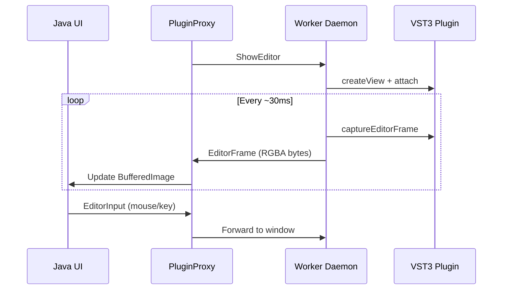

# Plugin Sandbox — Out-of-Process VST3 Hosting

## Overview

Hibiki supports running VST3 plugins in isolated worker processes for **crash isolation** (a bad plugin can't kill the DAW) and **parallelization**. The user can toggle between in-process and sandboxed modes in Settings → Audio.

## Architecture

```
┌─────────────────────┐     WorkerChannel IPC     ┌─────────────────────┐
│   hbk-play (host)   │  ◄──  commands/responses ──►  │  hbk-plugin-worker  │
│                     │                               │                     │
│  PluginProxy        │   shared memory (audio)       │  Vst3Plugin         │
│  (IPlugin)          │  ◄──  float[][] ────────►     │  (direct SDK calls) │
└─────────────────────┘                               └─────────────────────┘
```

Each plugin instance runs in its own worker process. The host communicates via:
- **Command channel**: serialized protobuf messages (load, set param, process, etc.)
- **Audio buffers**: shared memory (zero-copy)

## IPlugin Interface

Both `Vst3Plugin` (in-process) and `PluginProxy` (out-of-process) implement:

```cpp
class IPlugin {
public:
  virtual ~IPlugin() = default;
  virtual bool load(const std::string& path, int plugin_index, double sample_rate) = 0;
  virtual void process(float** inputs, float** outputs, int num_samples,
                       const HostProcessContext& ctx,
                       const std::vector<MidiNoteEvent>& events) = 0;
  virtual void setParameterValue(uint32_t id, double value) = 0;
  virtual double getParameterValue(uint32_t id) const = 0;
  virtual int getParameterCount() const = 0;
  virtual bool getParameterInfo(int index, VstParamInfo& info) const = 0;
  virtual const std::string& getName() const = 0;
  virtual bool isInstrument() const = 0;
  virtual void showEditor() = 0;
  virtual void stopEditor() = 0;
  // Editor framebuffer capture (for remote GUI forwarding)
  virtual bool captureEditorFrame(std::vector<uint8_t>& rgba, int& w, int& h) { return false; }
  virtual void sendEditorInput(int type, int x, int y, int button, int key, int delta) {}
};
```

## Platform IPC

The IPC layer is abstracted behind `WorkerChannel`:

```cpp
class WorkerChannel {
public:
  virtual ~WorkerChannel() = default;
  virtual bool send(const void* data, size_t len) = 0;
  virtual bool recv(void* data, size_t len) = 0;
  virtual float* inputBuffer(int channel) = 0;
  virtual float* outputBuffer(int channel) = 0;
};
```

### Local Sandbox (Linux / macOS)

| Component | Implementation |
|-----------|---------------|
| Command channel | Unix domain socket |
| Audio buffers | POSIX shared memory (`shm_open` / `mmap`) |
| Worker spawn | `fork()` + `exec()` |
| Parent death signal | `prctl(PR_SET_PDEATHSIG)` (Linux), `kqueue` (macOS) |
| Crash detection | `waitpid(WNOHANG)` |

### Local Sandbox (Windows)

| Component | Implementation |
|-----------|---------------|
| Command channel | Named pipe (`\\.\pipe\hbk-plugin-XXXX`) |
| Audio buffers | Win32 shared memory (`CreateFileMapping` / `MapViewOfFile`) |
| Worker spawn | `CreateProcess()` |
| Parent death signal | Job object with `JOB_OBJECT_LIMIT_KILL_ON_JOB_CLOSE` |
| Crash detection | `WaitForSingleObject(hProcess, 0)` |

### Remote Daemon (Cross-OS via TCP)

The IPC layer can also operate completely over the network without shared memory logic.

| Component | Implementation |
|-----------|---------------|
| Command channel | TCP socket (e.g. port 9100) |
| Audio buffers | Embedded directly in Protobuf messages (`WorkerChannelTcp`) |
| Worker spawn | Supervised by `hbk-worker-daemon` accepting connections. |
| Crash detection | Network link closure or socket timeouts |

## Remote Worker Deployment

This infrastructure enables **Cross-OS VST hosting**. For example, you can host Windows-exclusive VST3 plugins inside a macOS DAW by letting `PluginProxy` pipe audio through a TCP stream to `hbk-worker-daemon` running on a networked PC.

### 1. Launch the Remote Worker (Host)
Execute the `hbk-worker-daemon` binary on the target machine where the plugins reside natively:

```bash
# Starts listening on TCP port 9100 synchronously
./hbk-worker-daemon --port 9100
```

### 2. Configure the Local Client (DAW)
On the local workstation running Hibiki, you can assign `PluginProxy` to connect out to that IP instead of spawning a local subprocess. 

At the GUI level, this is configured in Settings → Audio → Plugin Hosting Mode → Remote TCP.

At the C++ level, this is configured during initialization by using the overloaded constructor:

```cpp
// Initialize proxy to fetch and process plugin data via the networked PC
auto remote_plugin = std::make_unique<PluginProxy>("192.168.1.100", 9100);
remote_plugin->load("C:\\Program Files\\Common Files\\VST3\\Synth.vst3");
```

## Shared Memory Layout

The buffer size `N` is configurable (64, 128, 256, 512, 1024, 2048, 4096 samples). Default: 512.

```
Offset  Size        Content
0       64 B        Header (block_size, num_channels, flags)
64      N×4 B       Input L  [N × float]
64+N×4  N×4 B       Input R  [N × float]
64+N×8  N×4 B       Output L [N × float]
64+N×12 N×4 B       Output R [N × float]
──────────────────────────────────────────────
Total:  64 + N×16 bytes per plugin instance
        (e.g. 512 samples → ~8.25 KB, 2048 → ~32.8 KB)
```

The `flags` field in the header is used for lock-free synchronization:
- Host writes input → sets `flags = READY`
- Worker reads input, processes, writes output → sets `flags = DONE`
- Host reads output → sets `flags = IDLE`

## Process Lifecycle

1. **Spawn**: `PluginProxy::load()` creates shared memory, spawns `hbk-plugin-worker` with socket/pipe path as argument
2. **Load**: Host sends `LoadPlugin` command with VST3 path and plugin index
3. **Process loop**: For each audio block, host writes input to shared memory, sends `Process` command, worker processes and responds
4. **Crash recovery**: `PluginProxy` detects worker death via `waitpid`/`WaitForSingleObject`, respawns worker, reloads plugin with cached state
5. **Shutdown**: Host sends `Shutdown` command, worker exits cleanly

## Settings

Configured in Settings → Audio:

### Plugin Hosting Modes
- **In-Process (Default)**: Uses `Vst3Plugin` directly. Lowest latency, no isolation.
- **Sandboxed (Local)**: Uses `PluginProxy()` to silently spawn an `hbk-plugin-worker` background process. Isolates plugin crashes via local shared memory bridging.
- **Network Daemon (Remote)**: Configures `PluginProxy(host, port)` to utilize `WorkerChannelTcp`, pushing all buffer and state modifications across the network to a standalone `hbk-worker-daemon` node.

### Audio Buffer Size
- **Options**: 64, 128, 256, **512** (default), 1024, 2048, 4096 samples
- **Tradeoff**: Smaller buffers → lower latency but higher CPU (more process calls/sec). Larger buffers → higher latency but lower CPU.
- At 44100 Hz: 512 samples ≈ 11.6ms latency, 128 samples ≈ 2.9ms, 2048 ≈ 46.4ms
- Applies to both in-process and sandboxed modes

Changing either setting requires a backend restart.

## Remote Editor UI Forwarding

When a plugin runs on a remote daemon, its native GUI can be forwarded to the local client:



**Platform capture methods:**
- **X11 (Linux)**: `XGetImage` / `XSendEvent`
- **Win32**: `BitBlt` + `CreateDIBSection` / `PostMessage`
- **macOS**: Stub (TODO: `CGWindowListCreateImage`)
